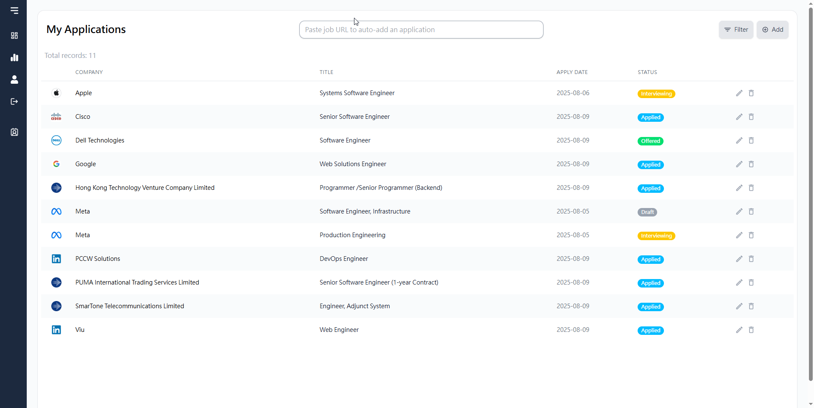
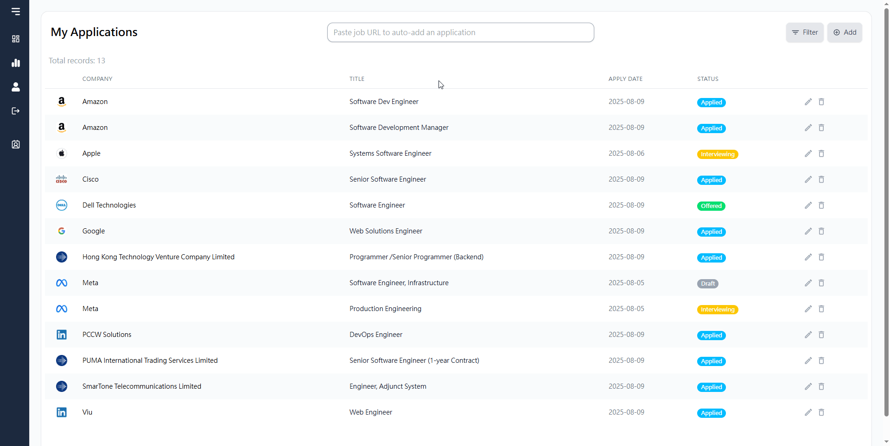
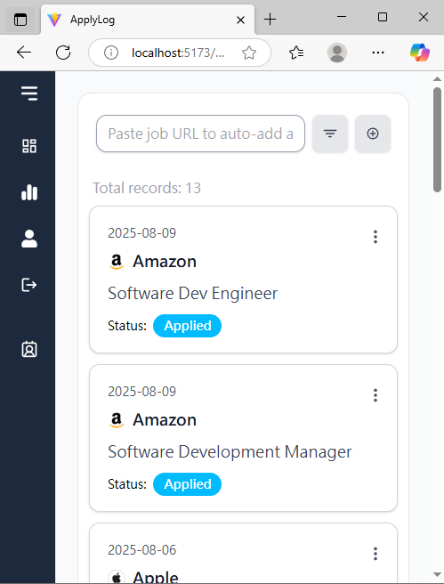

# JobLog

JobLog is a full-stack app that helps you record your job applications easily — just paste a job posting URL, and the AI + web scraping engine instantly pulls all the key job details for you.

 

## Background
I used to type all my job application details into Excel, it just felt like such a hassle. I wanted a simpler, quicker way to keep track of everything without all the manual work. That’s how this app was born.

## Key Features

* **Application Management**: Easily Create, Read, Update, and Delete job application records.

* **AI-Powered Autofill**: Integrates Web scraping with the Google Gemini API to automatically create application records from a pasted job posting URL. Extracts and stores key job details such as title, requirements, location, and salary — **all in just 6 - 10 seconds**, saving you from boring manual entry.

* **Secure User Authentication**: Support user registration and login system with secure JWT-based authentication.

* **UI/UX**: Clean and responsive frontend for a smooth user experience on both large screens (desktop/tablet) and small screens (mobile).

## Screenshots
* Table View Design for Desktop/Tablet

 

* Card View Design for Mobile

 

## How AI Autofill Works

The core of this feature is to transform a job posting webpage into structured data and save it automatically to the database. The entire process can be broken down into the following procedure:

User Pastes URL -> Web Scraping -> AI Data Extraction-> Database

### Intelligent Web Scraping

To handle websites built with different technologies, I implemented two strategies:

* **Static-First with Jsoup**: The backend AIAutofillService first attempts a quick scrape using Jsoup to get the static HTML, as this is the fastest way to retrieve the HTML content.

* **Fallback with Selenium**: If Jsoup fails to get the HTML due to some reason (e.g. anti web scraping, page rendered by JavaScript) the system switches to Selenium WebDriver, which simulates a real browser to get the final HTML.

After getting the content, the system cleans the HTML by removing irrelevant elements in order to provide core job description text to Google Gemini.

### AI Data Extraction
* **Prompt Engineering**: The prompt instructs the AI to find key fields like companyName, jobTitle, salary, etc.

* **Structured JSON Output**: Most importantly, the prompt forces AI to respond with only a pure JSON object. This allows the backend to reliably parse the data without dealing with unpredictable natural language.

## Tech Stack

**Backend**
- Language: Java 17
- Framework: Spring Boot 3.5.3
- Database: PostgreSQL
- Authentication: Spring Security
- Dependency Management: Gradle

**Frontend**
- Language: TypeScript
- Framework: React.js
- Styling: Tailwind CSS
- Dependency Management: npm

## How to develop locally
> Note: A Docker-based setup is planned for the future. For now, follow the steps below to run locally.

1. Prerequisites
    * JDK 17
    * Node.js and npm
    * PostgreSQL database server
    * Chrome Browser

2. Clone the repository

3. Environment Variable Setup

    For Backend
    * GEMINI_API_KEY: Your Google Gemini API key
    * DATASOURCE_USERNAME: PostgreSQL database username
    * DATASOURCE_PASSWORD: PostgreSQL database password
    * JWT_SECRET: secret key for JWT authentication

    For Frontend
    * VITE_API_URL: This variable defines the base URL for your backend API.
    
4. Database Setup
    * Ensure you have a PostgreSQL database named job-application-tracker-db created.

5. Run both the backend and the frontend

## Known Limitations
* Web Scraping Resistance: The auto-add function, which relies on web scraping techniques, may encounter difficulties on certain websites that implement advanced anti-scraping measures.

### Auto-add Capabilities:

**Worked Websites:** LinkedIn, Jobsdb, Google Careers, Apple Careers, AWS, Meta, and more...

**Known Limitations:** Indeed, Oracle, Netflix 